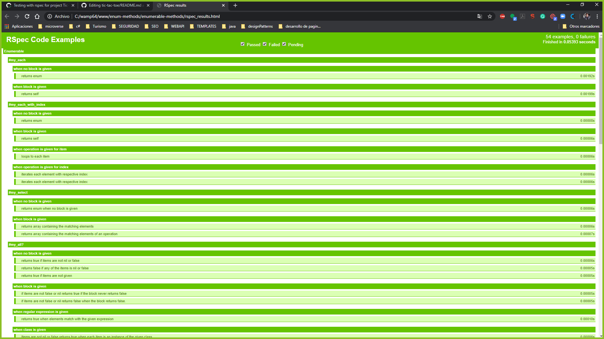

# Enumerable Methods

## Project specifications

Enumerable module that gets mixed into the Array and Hash classes (among others) and provides you with lots of handy iterator methods.

## Built With

Concepts used on this project

- Ruby
- Loops
- Yield
- Describe, let and it for testing

Tools used on this project

- Visual Studio Code
- VSCode Ruby by Stafford Brunk
- Rubocop for Visual Studio Code
- RSpec testing framework

## Testing with RSpec 

To run the test cases with RSpec we have to follow this steps:

installing RSpec

    gem install rspec

Once that’s done, you can verify your version of RSpec with, for this project we had used the version 3.9 

    rspec --version

finally run for watch the results

    rspec

## Watch the result of RSpec

if you want to see the result of testing with rspec follow this link [Results](https://raw.githack.com/enelesmai/enumerable-methods/testing-specs/rspec_results.html)

## Screenshot

## Live Demo

You can see the [live preview](https://repl.it/@enelesmai/enumerable-methods-1)

## Authors

👤 **Xóchitl Selene Flores Pérez**

- Github: [@enelesmai](https://github.com/enelesmai)
- Twitter: [@enelesmai](https://twitter.com/enelesmai)
- Linkedin: [xochitlselene](https://linkedin.com/in/xochitlselene)

## Contributing

This is an education project as a part of the Microverse so contributing is not accepted. 

Contributions, issues and feature requests are welcome!

Feel free to check the [issues](https://github.com/enelesmai/enumerable-methods/issues).

## Show your support

Give a ⭐️ if you like this project!

## Acknowledgements

+ [Github](http://github.com/).
+ [The Odin Project](theodinproject.com/).

## License

This project is [MIT](lic.url) licensed.
